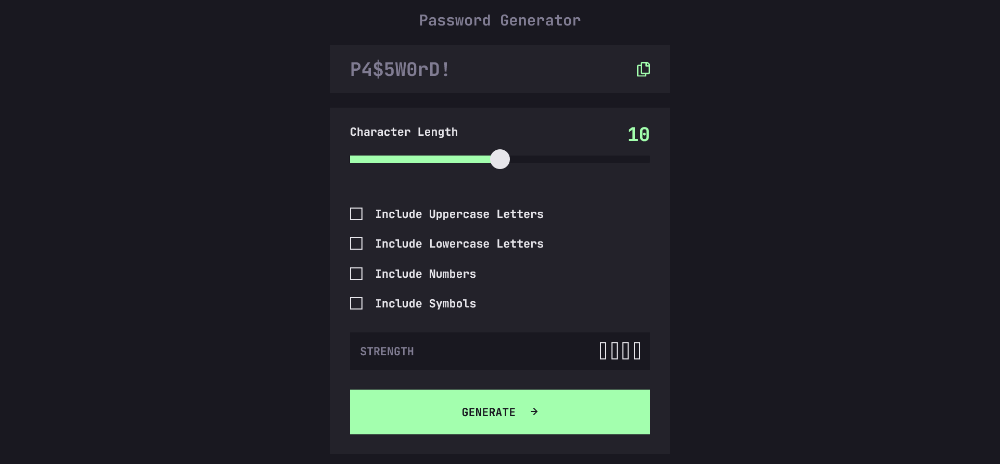

# Frontend Mentor - Password generator app solution

This is a solution to the [Password generator app challenge on Frontend Mentor](https://www.frontendmentor.io/challenges/password-generator-app-Mr8CLycqjh). Frontend Mentor challenges help you improve your coding skills by building realistic projects.

### Screenshot

### Links

-   Solution URL: [Github](https://github.com/MarcinFiuk/password-generator)
-   Live Site URL: [Vercel](https://password-generator-marcinfiuk.vercel.app/)

### Built with

-   [React](https://reactjs.org/) - JS library
-   [TypeScript](https://www.typescriptlang.org/) - Strongly typed programming language that builds on JavaScript
-   [Testing Library](https://testing-library.com/) - Simple and complete testing utilities
-   [Tailwind CSS](https://tailwindcss.com/) - A utility-first CSS framework packed

### What I learned

I learnt a few new concepts:

-   Create unit tests
-   Improve TypeScript

## Author

-   LinkedIn - [Marcin Fiuk](https://www.linkedin.com/in/marcin-fiuk-0b498b241/)
-   Frontend Mentor - [@MarcinFiuk](https://www.frontendmentor.io/profile/MarcinFiuk)
-   Twitter - [@marcin_fiuk](https://twitter.com/marcin_fiuk)
